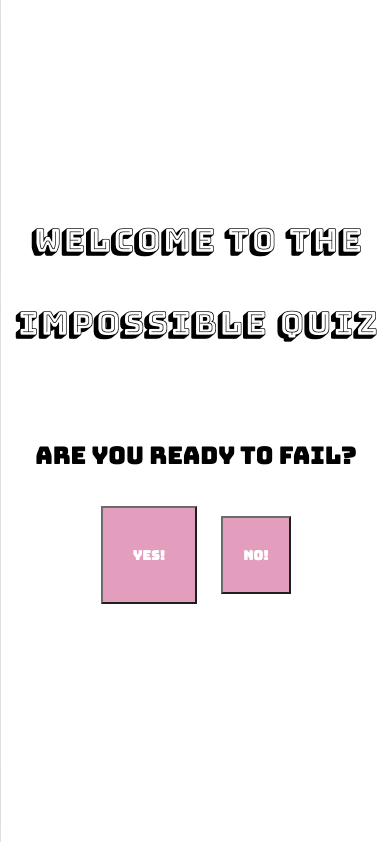
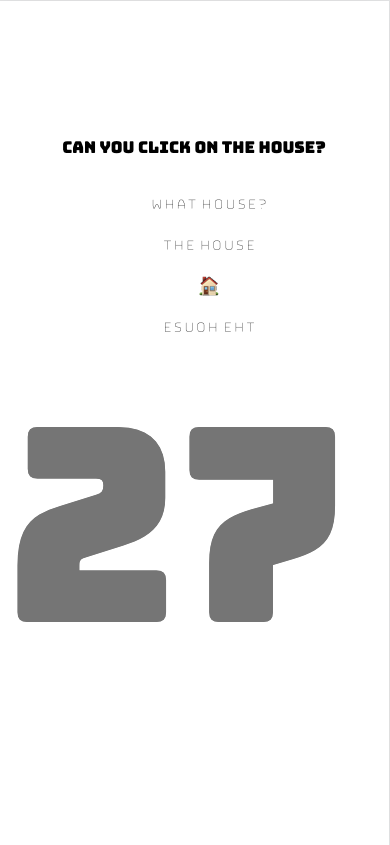
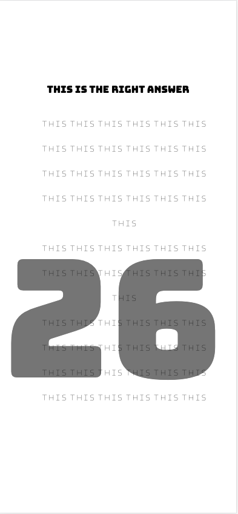

# Impossible Quiz

# Project Objectives
1. To create an interactive website that holds a quiz of any kind.
2. To practice JavaScript fundamentals. 

# Project Description 
The Impossible Quiz is a fun and interactive quiz that does the following:
- Has a timer of 60 seconds that starts running when the user starts the quiz
- Has a timer of 60 seconds that starts running when the user starts the quiz
- Presents the users with 4 different questions and 4 different answers per question
- If the user selects the wrong answer, prompt buttons will indicate that it was wrong
- If the user selects the wrong answer, 3 seconds will be deducted from the timer
- If the user selects the right answer, prompt buttons will indicate that it was correct
- If the user gets all answers correct before time runs out, the user will get a win
- If the user gets a win, a congratulatory message will show up and the win count will add 1
- If the timer runs out before the user responds correctly to all questions, the user will get a loss
- If the user gets a loss, a loosing message will show up and the loss count will add 1
- Counts and logs the wins and losses of the user
- Allows the user to log their high score, based on seconds left, with their initials
- Allows the user to play again 

# Play Experience 
Instead of a regular quiz on a random subject, the Impossible Quiz aims to make it more fun, and maybe more frustrating, for the user. Questions are tricky and answers are not always in the place you imagined.

# Links
This is the link to the GitHub Repo: https://github.com/ggggglo/Impossible_Quiz

This is the link to the deployed website: https://ggggglo.github.io/Impossible_Quiz/

# Images
This is what some parts of the website look like:

      

